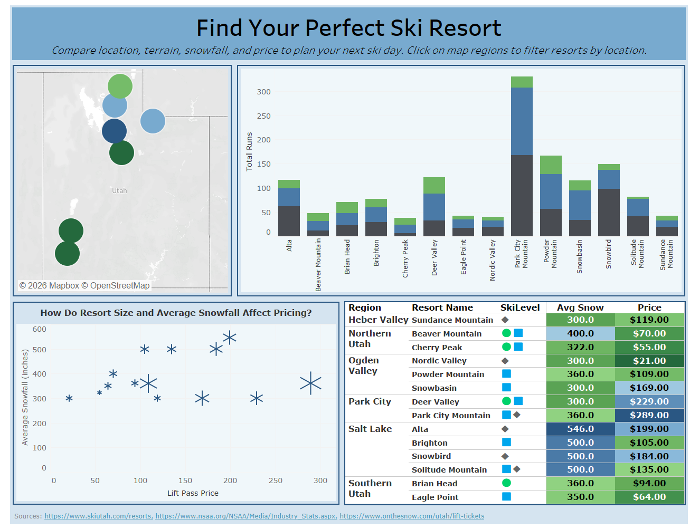

# Finding Your Perfect Utah Ski Resort
### Interactive Tableau Dashboard | DATA 3400 – Data Visualization with Tableau



## Overview

An interactive Tableau dashboard comparing 14 Utah ski resorts across pricing, terrain difficulty, average snowfall, and resort size. The goal is to help skiers and snowboarders identify which Utah resort best fits their budget, skill level, and preferences.

Resorts are grouped into four categories derived from clustering on price, terrain, and snowfall:

| Category | Resorts |
|---|---|
| Affordable – Beginner/Intermediate | Beaver Mountain, Cherry Peak, Brian Head, Eagle Point |
| Lower-Cost – Advanced, Below-Avg Snowfall | Sundance, Nordic Valley |
| High-Cost – Advanced, Above-Avg Snowfall | Alta, Brighton, Snowbird, Solitude |
| High-Cost – All-Skill, Below-Avg Snowfall | Deer Valley, Park City Mountain, Snowbasin, Powder Mountain |

## Dashboard Features

- **Highlight table** – compares all 14 resorts by region, skill level, average snowfall, and lift ticket price with conditional color encoding
- **Scatterplot** – shows the relationship between average snowfall and lift pass price, with marker size scaled to skiable acres
- **Stacked bar chart** – displays terrain distribution (green/blue/black runs) by resort to indicate difficulty profile
- **Interactive filters** – allow users to narrow results by region, skill level, and price range

## Data Sources

Data was collected from publicly available sources:
- [Ski Utah](https://www.skiutah.com/) – resort-level stats (terrain, acreage, snowfall)
- [On the Snow](https://www.onthesnow.com/utah/lift-tickets) – lift ticket pricing
- [National Ski Areas Association (NSAA)](https://nsaa.org/) – national visitor and season data

## Repository Contents

```
├── ski-resort-dashboard.twbx          # Final Tableau packaged workbook
├── dashboard-screenshot.png           # Dashboard preview
├── Utah Ski Resorts Executive Summary.pdf   # One-page findings summary
├── Data Narrative.pdf                 # Project narrative and process log
└── Data/
    ├── Ski Data.xlsx                  # National ski area data (NSAA)
    ├── Ski Pass Prices.xlsx           # Lift ticket prices per resort
    └── Utah Ski Resorts.xlsx          # Utah-specific resort attributes
```

## How to View

Open `ski-resort-dashboard.twbx` in [Tableau Desktop](https://www.tableau.com/products/desktop) (free trial available) or upload it to [Tableau Public](https://public.tableau.com/) to interact with the dashboard in a browser.
